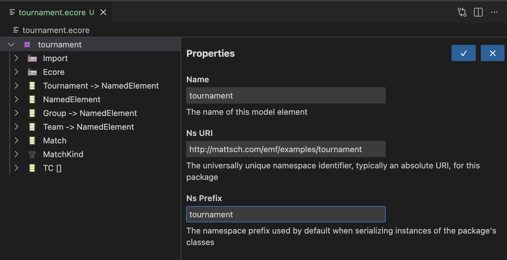

# TSP (Tree Structure Protocol)

TSP explores an LSP-like JSON-RPC protocol for **tree-based model editing**.
This repository contains:

- a protocol/API module (`tsp-java`)
- an EMF-based server implementation (`tsp-emf`)
- a VS Code custom editor extension (`vscode-tsp-editor`)

The current implementation is focused on EMF models (notably `.ecore`) and provides a reflective editor experience with a tree panel and form panel.



## Current Features

- Open model documents in a VS Code custom editor.
- Browse model contents as a tree (`tree/getChildren`).
- Edit single-valued properties in a form (`form/getTreeNodeForm`, `form/commitTreeNodeForm`).
- Save, Save As, and document close handling.
- Undo/redo backed by EMF command stack (`document/undoEdits`, `document/redoEdits`).
- Context menu commands on tree nodes:
	- `New...` commands generated from EMF child descriptors.
	- `Delete` command for removable nodes.
- Edit notifications include affected object IDs so frontend can refresh relevant tree/form parts.

## Architecture

### 1) Protocol layer (`tsp-java`)

Defines Java record-based API contracts for JSON-RPC methods and notifications, including:

- Document lifecycle and persistence
- Tree structure and tree edit commands
- Form-based property editing
- Undo/redo and edit notifications

### 2) Server layer (`tsp-emf`)

Implements protocol methods using EMF:

- Loads resources and maintains a per-document command stack.
- Builds tree nodes from EMF resources/objects.
- Builds form definitions from EMF item property descriptors.
- Executes edit commands (set/add/delete) through command stack.
- Emits `document/edited` notifications with edit kind and affected IDs.

### 3) VS Code extension (`vscode-tsp-editor`)

Provides a custom editor and webview UI:

- Spawns/connects to the TSP server via `vscode-jsonrpc`.
- Forwards webview requests, injecting `documentUri`.
- Receives and forwards edit notifications to the webview.
- Integrates custom editor undo/redo behavior with server requests.

## Repository Structure

- `tsp-java/` — protocol contracts and launcher utilities
- `tsp-emf/` — EMF-backed server implementation and tests
- `vscode-tsp-editor/` — VS Code extension + webview frontend
- `examples/models/` — sample model files

## Build & Validate

From repo root:

```bash
mvn -f tsp-java/pom.xml -q install
mvn -f tsp-emf/pom.xml -q test
cd vscode-tsp-editor && npm run compile
```

## Status

This is an active prototype aimed at validating protocol shape, architecture, and editor workflow for tree-structured model editing.
